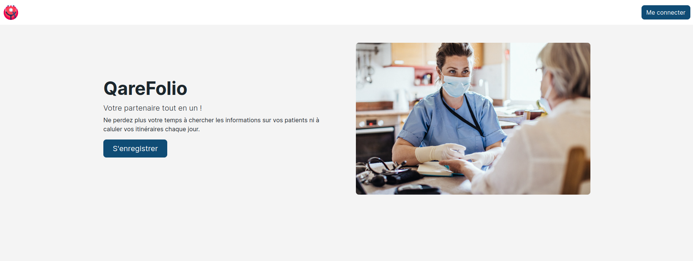

# QareFolio

---

### Table of Contents

- [Description](#description)
- [Technologies](#technologies)
- [Scope Of Functionalities](#scope-of-functionalities)
- [Project Status](#project-status)
- [Author Info](#author-info)

---

## Description
QareFolio web application build with Ruby On Rails for nurses working in patients'homes. QareFolio improves the daily life of caregivers and patient care.

---

## Technologies

- Ruby version 3.1.2
- Ruby On Rails version 7
- JavaScript
- Google Maps API

---

## Scope Of Functionalities

1. Global vision of patients
2. Global vision of cares to be provided
3. Easier consultation management

---

## Project Status
The project is still on going. It must be improve with new features and some bugs must be fixed.

#### Contributing
This project was carried out with my colleague Aurélien.

---

## Author Info
I am a nurse and passionate about new technologies. I decided to train in computer coding. I want to help health professionals with new technologies and it's in this spirit that I created QareFolio with my friend Aurélien, a great UI designer.

[Back To The Top](#QareFolio)
